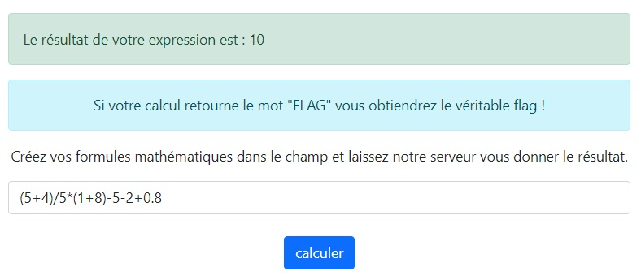

# CTF - EVAL(ECHEC ET MATH)

## Présentation du CTF 
**ID** 47 dans **les CTFs de Cyrhades**

Ce CTF va vous prouver que les filtres ne sont pas toujours aussi efficace qu'on l'imagione 
Créez une formule mathématique qui retourne le mot "FLAG" !

## Aperçu

-----------

## Installation manuel
Vous n'utilisez pas l'application **les CTFs de Cyrhades** ? C'est dommage !
Mais voici comment installer ce CTF manuellement :

> git clone https://github.com/Hack-Oeil/EVAL_ECHEC_ET_MATH.git

> cd EVAL_ECHEC_ET_MATH
